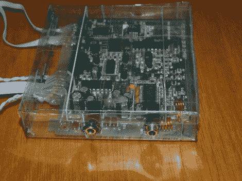
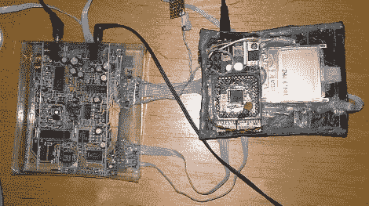
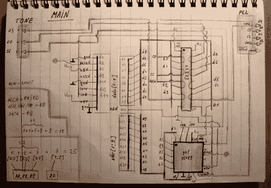

# 复活 ISA 硬件

> 原文：<https://hackaday.com/2010/06/09/resurrecting-isa-hardware/>

[亚历克斯]有一个旧的调频收音机调谐卡来到他身边。它使用了一个 ISA 连接器，这是一个在 90 年代中期过时的标准。他面临着实现 ISA 总线来配置卡的挑战。[他想出的](http://picasaweb.google.com/115619990957217642967/Devices)是一个使用 is a 卡的工作无线电，由 PIC 16F877 驱动。休息之后，请加入我们，查看原理图、代码和一些细节。

该卡基于一个配有 LC7534 音调/音量控制器的 LM7000 PLL 频率合成器。通过对数据表的研究，Alex 发现了芯片的数据引脚映射到 ISA 总线的位置。使用原型板，最困难的部分是找到芯片的地址。他最终测试了所有 256 种可能性，并观察从 ISA 总线锁存的数据。亚历克斯说，硬件能够从大约 60 兆赫调谐到 125 兆赫。

我们问他是否愿意分享他的代码和原理图。他完成了这两项工作，并为如此清晰的手绘示意图向他致敬。干得好[亚历克斯]！

[源代码](http://blog.mahalo.com/hackaday/misc/ISA-fm-radio.tar.gz) (Tarball)

