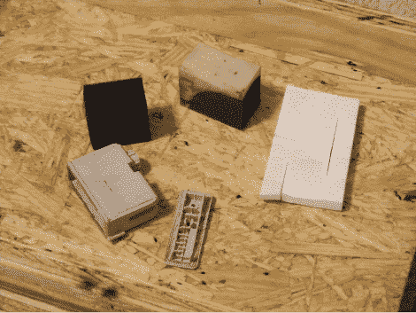
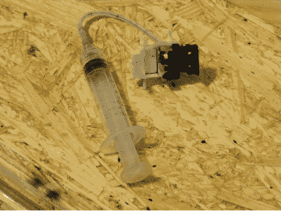
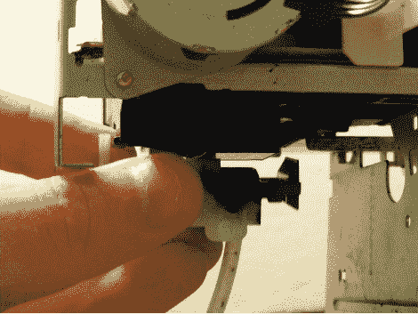
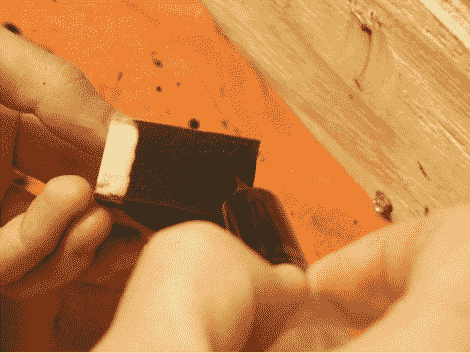
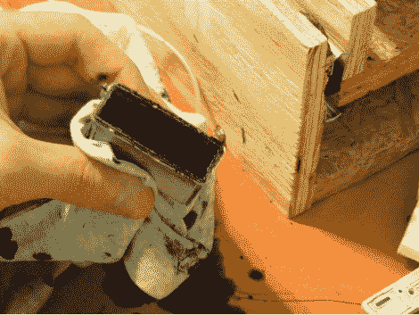
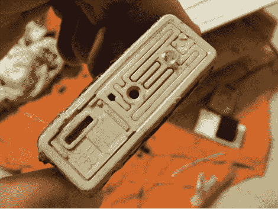
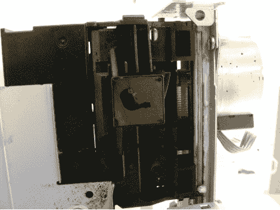
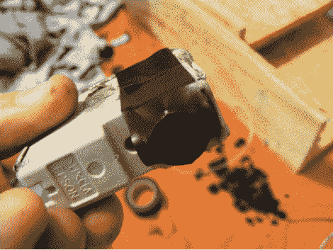
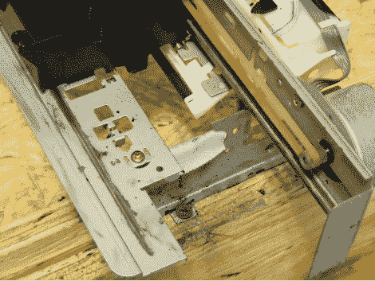

# (迷你)如何:重新填充您的 DTG 油墨

> 原文：<https://hackaday.com/2010/06/09/minihow-to-refill-your-dtg-inks/>

展示完我们的 DIYDTG 后，人们问的第一和第二件事是……
“它在洗涤过程中保持得怎么样？”
和……
“你是怎么换墨水的？”
虽然我们已经多次解释了第一个问题(普通墨水会褪色，DTG 墨水会变得更淡，但仍然存在)，但我们有望通过教程来回答第二个问题。

更换或重新填充我们使用的爱普生墨盒相对简单。你需要一些补给。
-旧的/用过的(或新的， 但你会浪费墨水)爱普生墨盒
-DTG 墨水(我们推荐[DTGinks.com](http://dtginks.com/))
–[SSC 实用程序](http://www.ssclg.com/epsone.shtml)(这让你的打印机误以为它有新墨盒)
-Windex(氨水不会使打印头生锈)
-塑料注射器
-平头螺丝刀
-热熔胶
-绝缘胶带
-小杯子
-抹布(墨水到处都是)
-解决
-时间(很多)
-(可选)来自其他打印机的海绵
-(可选)乳胶手套
-来自打印机的原始头废料收集件。

列表中的底部项目是一个小漏斗和橡胶滚轴，当它在你的打印机中处于“原位”时，它们原本位于头部的正下方。它的工作是将墨水从喷头中吸出，同时进行清洗和涂底漆。

公平的警告，不戴手套你的手指会变黑/变脏。

你首先要拿起平头螺丝刀，撬开墨盒的顶部。确保它保持完整，我们将重复使用它，并将其粘回。从那里，拉出位于墨盒中的旧海绵。

将一些 Windex 倒入杯中，并放入药筒和顶部。你可以把原来的海绵也浸泡在杯子里，或者切一块新的海绵。我们不推荐厨房海绵(太多大孔)，但我们在旧打印机的“墨水回收容器”中发现了几个干净的海绵——因为缺乏更好的术语。

让它浸泡(我们建议过夜)。

我将借此机会解释如何灌注你的大脑。你会想确保你把一些墨盒:墨水，DTG 墨水，Windex，或其他。只是不要试图用空气/无弹药筒灌注你的头部！

拿起注射器，将其推到连接到废物收集件的软管上。

你将把它放在头部喷嘴的下面(在下图中看为点)，用一只手把它推向头部。用另一只手拔出注射器(形成真空)。你应该得到一个漂亮的厚流无论你把什么墨盒。如果没有，晃动废物收集件，直到形成密封。我们平均抽取大约 1 毫升的液体进行灌注。

(可选)如果您认为您的打印机有很多堵塞的打印头，您可以从杯中取出墨盒。把它放在你的打印头里，然后装满 Windex。如上所述灌注。你的头脑应该是干净和清晰的。

一旦你的海绵浸湿了(或者你切了一个新的)，只需将墨水/DTG 墨水滴在海绵的一端，海绵将首先被推入墨盒。我们用了大约 10 毫升，不要填满你的海绵。

首先将浸泡过的一端塞入筒中，向下推到底部，但确保不要推得太远，海绵的顶部必须接触到盖子(为什么这一点很重要)。

你会注意到，通过将海绵挤压到墨盒中，海绵中额外的先前未填充的区域被浸湿。

推上盖子，在边缘周围涂上热胶水，它必须是气密的(但不要太紧，这样你就再也不能把盖子打开了，我们假设你会想再次装满)。并在除主孔以外的任何孔中放入少量。

通过这样做盖子(用海绵和胶水),你就创造了一个气密密封，只让正确数量的墨水流出。如果你之前用 Windex(可选阶段)清洗过你的头部，没有按照指示使用海绵和盖子，你可能已经注意到如果没有这个密封，液体会很容易地从头部流出，你不会希望这样的。

(如下图，墨水滴出)

将一条紧密的绝缘胶带缠绕在套筒上，完全覆盖并密封底部孔。只需要绕一圈，太多的话，塑料长钉可能无法刺穿胶带。

将墨盒放入磁头，从这里开始，直到墨盒完全清空，不要将其从磁头上取下。准备好你的头。在这一点上，如果你把太多的墨水放入海绵中，你会看到它从头上掉下来(如上所述)。别担心，别管它了。在下面放一块抹布，然后等待(再次强调，最好是过夜)。到了早上，你应该能够擦掉所有多余的，涂上底漆，没有墨水会“掉出来”。

我们还添加了一小块抹布作为橡胶扫帚，当它回到原位时帮助清洁头部。

你完了！做大量的试印，你会发现第一批印出来的有些会很乱(我们用了 10 次全印才得到恒定的暗度)。