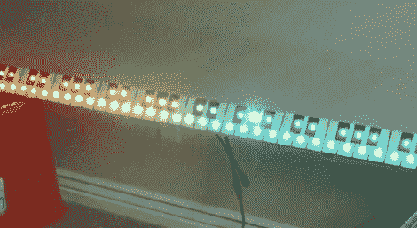

# DMX 键盘显示器

> 原文：<https://hackaday.com/2010/06/10/dmx-keyboard-display/>

这个[键盘显示器](http://response-box.com/rgb/2010/06/driving-rgb-nodes-with-midi-note-messages/)的每个按键都有一个 RGB LED，可通过通用舞台灯光协议 DMX 进行寻址。休息后看到的项目视频很好地向我们展示了这个概念。通过使用 MIDI 到 DMX 转换器盒，John 可以在显示器的适当按键上显示来自键盘的 MIDI 信号。通过进一步摆弄转换器盒中的固件，他在整个键盘上展示了一种等离子体效果，使每个按键对应的灯以亮白色弹出。跳到 3:45 左右听看《我的甜孩子》。

这不是(约翰)第一次被抓到闪光灯闪烁。他帮助制作了巨型 LED 圣诞树，点亮了我们的节日。

 <https://www.youtube.com/embed/CZvEqP5JSvA?version=3&rel=1&showsearch=0&showinfo=1&iv_load_policy=1&fs=1&hl=en-US&autohide=2&wmode=transparent>

 </body> </html>