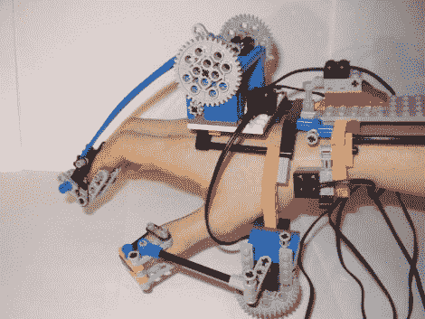

# 乐高手控器

> 原文：<https://hackaday.com/2010/06/12/lego-hand-controller/>

【大卫·海曼】[建造了这个装置](http://www.mocpages.com/moc.php/8062)来控制一个乐高爪子。事物的一端是你戴的部分，测量两个手指和你的拇指的运动。在事物的另一端是一个有三个相反数字的乐高爪。你动，它就动。该爪使用光传感器和梯度带进行位置反馈。还有上下手腕动作，使用触摸传感器作为输入。这足以给[狙击步枪](http://hackaday.com/2010/06/11/seven-six-two-millimeter-full-plastic-jacket/)留下深刻印象。

[通过[使](http://blog.makezine.com/archive/2010/06/lego_rc_hand_with_exoskeletal_contr.html)