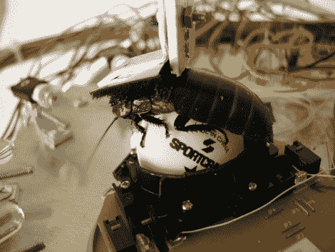

# 蟑螂皮条客的甜蜜旅程

> 原文：<https://hackaday.com/2010/06/11/cockroach-pimps-a-sweet-ride/>

这只巨大的马达加斯加发声蟑螂骄傲地骑在他的三轮机器人平台上。这个几年前的项目对我们来说是新的，休息后我们对视频的反应是复杂的。我们发现自己害怕了，高兴，惊讶，悲伤。

蟑螂控制机器人使用轨迹球类型的输入。一只乒乓球被一只栖息在上面的蟑螂旋转。幸运或痛苦(取决于你如何看待它)的小虫子前面有一排灯，当机器人前面有障碍时，它们就会发光。蟑螂天生厌恶光线，这应该会让它把腿从显示器的那一部分移开，从而让机器人远离障碍物。

我们过去见过一些生物黑客。有依靠老鼠脑细胞运行的机器人和 T2 遥控甲虫。但是这些项目都没有让我们想要进行这种类型的实验。你呢？

[https://player.vimeo.com/video/2398096](https://player.vimeo.com/video/2398096)

[谢谢斯科特曼]