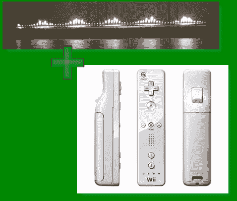

# 怀特控制的鲁本氏管

> 原文：<https://hackaday.com/2010/06/11/wiimote-controlled-rubens-tube/>

虽然我们可以像凯勒·卡夫建议的那样满足于我们的“儿童登陆日”。我们知道如果不先把自己炸飞，你就无法继续过这么棒的周五。

这个 [Wiimote Rubens 的电子管](http://www.instructables.com/id/Wiimote-Rubens-Tube%3a-Control-Fire-With-Sound!-And/)引起了我们的注意。一根 [PVC](http://hackaday.com/2007/06/25/reubens-tube-fire-sound-visualization/) 铝制灌溉管钻有孔，丙烷被泵送通过。一端的扬声器产生压力变化，随之而来的是整齐的灯光表演。[ScaryBunnyMan]走得更远，用一套软件和一个 Wii 遥控器，他“扮演上帝”控制音乐，从而控制火。看看分裂后的有趣视频。

[通过[使](http://blog.makezine.com/archive/2010/06/how-to_wiimote_rubens_tube.html)

[https://www.youtube.com/embed/ZPx6xdnjIAs?version=3&rel=1&showsearch=0&showinfo=1&iv_load_policy=1&fs=1&hl=en-US&autohide=2&wmode=transparent](https://www.youtube.com/embed/ZPx6xdnjIAs?version=3&rel=1&showsearch=0&showinfo=1&iv_load_policy=1&fs=1&hl=en-US&autohide=2&wmode=transparent)