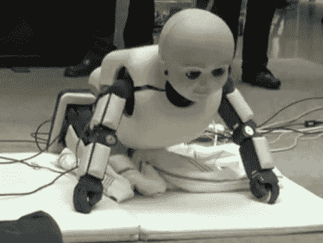

# 蹒跚学步的安卓

> 原文：<https://hackaday.com/2010/06/13/toddler-android/>

我们看到了这个蹒跚学步的机器人的几个视频。它坐起来，翻身，并使用视觉，听觉和传感器输入对周围的人做出反应。休息之后，你会看到这些动作很像小孩子的动作。当它的训练者试图帮助它摆脱毯子时，机器人的重量就暴露无遗。它似乎会对周围的人报以微笑和闪烁的…呃…相机眼睛。我们想知道它是否会以[击倒一些](http://hackaday.com/2010/01/11/lego-robot-lays-dominoes-not-eggs/) 多米诺骨牌 为乐。

身体动作

 <https://www.youtube.com/embed/UQjtEMokT_Q?version=3&rel=1&showsearch=0&showinfo=1&iv_load_policy=1&fs=1&hl=en-US&autohide=2&wmode=transparent>

 
面部反应
 <iframe class="youtube-player" width="800" height="480" src="https://www.youtube.com/embed/8Mco57nNShA?version=3&amp;rel=1&amp;showsearch=0&amp;showinfo=1&amp;iv_load_policy=1&amp;fs=1&amp;hl=en-US&amp;autohide=2&amp;wmode=transparent" allowfullscreen="true" style="border:0;" sandbox="allow-scripts allow-same-origin allow-popups allow-presentation"/> </body> </html>