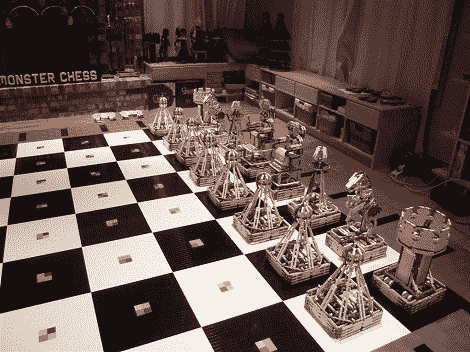

# 怪物象棋

> 原文：<https://hackaday.com/2010/06/14/monster-chess/>

超过 100，000 块乐高积木，4 个人一年的创作，以及一个 12 英尺乘 12 英尺的棋盘，使得这个[成为我们见过的最大最棒的乐高黑客](http://www.teamhassenplug.org/monsterchess/)。拿那个[乐高打印机](http://hackaday.com/2010/06/02/lego-printer-built-without-nxt-parts/)来说。

只需 30，000 美元，你也可以拥有这样的设置。[还没有太多的信息](http://thenxtstep.blogspot.com/2010/06/monster-chess.html)出来，但我们知道所有的部件都是通过一台装有 LabVIEW 的 PC 远程控制的，总共使用了 38 个 NXT 控制器。哦，当然你可以在 [2010 砖块世界](http://www.brickworld.us/bw2010/)现场观看。查看跳转后重播游戏的视频。

[via [极客专家](http://www.geekologie.com/2010/06/wow_30000_robotic_lego_chess_g.php)

 <https://www.youtube.com/embed/MAwwKEXn6Mk?version=3&rel=1&showsearch=0&showinfo=1&iv_load_policy=1&fs=1&hl=en-US&autohide=2&wmode=transparent>

 </body> </html>