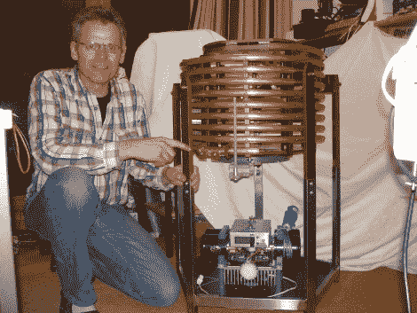

# 可调特斯拉线圈构造

> 原文：<https://hackaday.com/2010/06/16/adjustable-tesla-coil-build/>

这种线圈在四米长的空气中发射火花没有问题。[芬恩·哈默]已经在这项爱的工作上投入了很长时间，我们花了一些时间通读了他的进度线索。大约一年前，他开始走上这条路，每走一步，他都会创作出精美的作品。我们喜欢看他的原型制作技术，从概念到手绘，再到 CAD 图，然后开始物理构建。休息后查看演示视频，当你阅读他的帖子时，寻找指向其他视频和资源的绿色箭头。

4 米火花

 <https://www.youtube.com/embed/l-FAdM_5E-s?version=3&rel=1&showsearch=0&showinfo=1&iv_load_policy=1&fs=1&hl=en-US&autohide=2&wmode=transparent>

 
线圈在使用过程中如何调谐
 <iframe class="youtube-player" width="800" height="480" src="https://www.youtube.com/embed/NMbbBxiDozg?version=3&amp;rel=1&amp;showsearch=0&amp;showinfo=1&amp;iv_load_policy=1&amp;fs=1&amp;hl=en-US&amp;autohide=2&amp;wmode=transparent" allowfullscreen="true" style="border:0;" sandbox="allow-scripts allow-same-origin allow-popups allow-presentation"/> 
实时线圈调谐演示
 <iframe class="youtube-player" width="800" height="480" src="https://www.youtube.com/embed/71hpP56JwGg?version=3&amp;rel=1&amp;showsearch=0&amp;showinfo=1&amp;iv_load_policy=1&amp;fs=1&amp;hl=en-US&amp;autohide=2&amp;wmode=transparent" allowfullscreen="true" style="border:0;" sandbox="allow-scripts allow-same-origin allow-popups allow-presentation"/> 
[谢谢比尔]
 </body> </html>