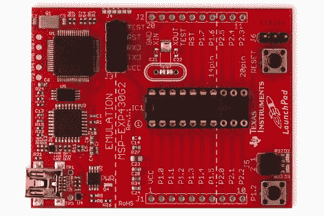

# 德州仪器大举收购业余爱好市场

> 原文：<https://hackaday.com/2010/06/22/ti-makes-a-big-bid-for-the-hobby-market/>

今天早上，德州仪器发布了 Launchpad，这是一个为他们的低成本 MSP430 系列微控制器开发的平台。我们以前见过这些芯片，最明显的是在 [ez430 Chronos 运动手表](http://hackaday.com/2009/11/25/ti-sports-watch-for-hacking/)中。我们认为这是对目前由 Arduino、PIC、AVR 和其他公司享有的爱好市场的出价。TI 最大的卖点是价格，但我们将等待与您分享。休息后加入我们，看看套餐提供什么，然后决定价格是否合适。

**什么事？**

我们的举报热线收到了一家公关公司代表德州仪器发出的联系请求。视频会议将我们与他们的一名工程师配对，该工程师向我们介绍了套餐的细节，每分钟左右都提到低价标签。Launchpad 是用于 [TI MSP430](http://en.wikipedia.org/wiki/MSP430) 的编程和开发板。它有一个机械 DIP 插座，可以接受多达 20 个引脚的芯片。所有这些引脚都连接到电路板两侧的接头端口，我们认为这类似于 Arduino 布局。好消息是，与 Arduino 不同的是，头部间距属于 0.1 英寸，这是与通用原型板接口所必需的。TI 也在寻求社区参与，推动他们的 [Lunchapad Wiki](http://www.ti.com/launchpadwiki) 来帮助你陈述，并要求你在 16 位平台取得成功时加入你的知识。

里面有什么？

每个 Launchpad 设备都有很多优点。除了板本身，您还可以获得一根 0.5 米的 USB 电缆、两个引脚接头和两个用于引脚分线板的引脚插座、两个不同的 MSP430 微处理器( [MSP430G2211](http://focus.ti.com/docs/prod/folders/print/msp430g2211.html) 和 [MSP430G2231](http://focus.ti.com/docs/prod/folders/print/msp430g2231.html) )和两个免费的 IDEs [Code Composer Studio 4](http://processors.wiki.ti.com/index.php/Code_Composer_Studio_v4) 和[IAR Embedded work bench Kickstart](http://focus.ti.com/docs/toolsw/folders/print/iar-kickstart.html?DCMP=MSP430&HQS=Other+OT+iarkickstart)(注意后者有 4K 或 8K 代码限制，取决于使用的处理器)。

**价格**

毫无疑问，TI 正试图让价格成为此次发布的最大问题。我们收到的演示文稿在十三张幻灯片中的七张上用红色大数字标出了价格。这就是:Launchpad 将花费你 4.30 美元。目前，运费已包括在内。

**结论**

需要注意的是，我们还没有拿到棋盘。也就是说，为了 4.30 美元，仅仅为了得到 USB 电缆和几个处理器就值得冒险。我们很惊讶他们把价格打回这一点，很高兴你得到了编程器和两个微控制器，更不用说其他组件。我们很高兴他们没有像 Arduino 那样为 AVR 控制器开发一种替代语言。这使得设置程序员、IDE 和工具链的障碍变得容易，并且可以直接用 c 语言开发。毕竟，芯片非常便宜并且非常强大。你可能记得他们中的 3000 人，来自我们在周末看到的一个项目。

我们可以想象最初的需求会很高，希望他们有足够的库存来维持。

**更新:**

视频拆箱

 <https://www.youtube.com/embed/RVHGjgkFPlU?version=3&rel=1&showsearch=0&showinfo=1&iv_load_policy=1&fs=1&hl=en-US&autohide=2&wmode=transparent>

 
演示应用视频
 <iframe class="youtube-player" width="800" height="480" src="https://www.youtube.com/embed/U0mGoRtYbyg?version=3&amp;rel=1&amp;showsearch=0&amp;showinfo=1&amp;iv_load_policy=1&amp;fs=1&amp;hl=en-US&amp;autohide=2&amp;wmode=transparent" allowfullscreen="true" style="border:0;" sandbox="allow-scripts allow-same-origin allow-popups allow-presentation"/> 
<strong> </strong>
 </body> </html>