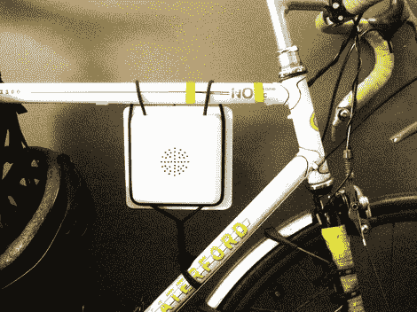

# 当你骑车时，Velosynth 会惹恼你周围的人

> 原文：<https://hackaday.com/2010/06/18/velosynth-annoys-those-around-you-as-you-ride/>

谈到公路自行车，我们总是相信“越安静越好”。你会发现这个真理，如果你花 100k 买了一个有 sqeaky 后变速器的人的后轮。但是很明显，Effalo 的人们从来没有吸取这个教训，因为他们已经生产了一种自行车电脑，当你骑车时它会产生噪音。

也许这只是需要一些聪明才智来把它变成一个漂亮的音乐制作工具，就像[原力训练器黑客](http://hackaday.com/2010/05/18/composing-music-with-the-force-trainer/)一样。没有问题，因为 velosynth 是一个可破解的设计。这个盒子是用真空成型的，在里面你会发现一堆小面包板。作为 Arduino/Xbee 组合的 [JeeNode](http://cafe.jeelabs.net/lab/jn4/) ，通过从自行车车轮获取速度和加速度数据，充当设备的心脏。从那里它被传递到不同的模块，鲍勃是你的叔叔，声音出来了。休息之后，看看他们的销售宣传，如果你开始有一些关于使用这个的想法，看看[他们提供的开源信息](http://wiki.velosynth.com/index.php?title=Main_Page)。

<https://player.vimeo.com/video/12657830>

 
[谢谢克里斯蒂安]
 </body> </html>