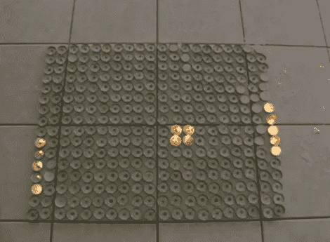

# 蜡烛停止运动:怎么做？

> 原文：<https://hackaday.com/2010/06/18/candle-stop-motion-hows-it-done/>

[Ollie]向我们透露了一个定格视频，该视频使用茶蜡烛网格来制作一些经典的像素化游戏图形。上图显然是一个正在进行的 pong 游戏。看起来很有趣，但对我们来说，有趣的是试图决定如何去做。点击休息时间观看视频并讨论方法。

 <https://www.youtube.com/embed/EG127HdhWZQ?version=3&rel=1&showsearch=0&showinfo=1&iv_load_policy=1&fs=1&hl=en-US&autohide=2&wmode=transparent>

 
也许这里使用的最明显的方法是简单的老式定格动画。你点燃蜡烛，拍照，熄灭你不需要的蜡烛，点燃新的，然后重复。还有一种想法是，创作者让视频滚动，走过他计划的帧，然后在事后编辑掉填充视频。
 
对我们来说，少了一样东西。每当我们熄灭燃烧了一段时间的茶烛时，它往往会放出一股相当强劲的烟柱。我们在视频中看不到这一点。我们的想法是，在点燃蜡烛之前，给所有的蜡烛拍张照。然后你给所有点燃的蜡烛拍几张照片。多个镜头是这样的，视频显示闪烁的火焰。从那里，一个图像处理程序可以与图层蒙版一起使用，以数字方式填充每一帧中不需要的蜡烛。下面是我们使用 Gimp 的尝试。但我们想知道你会怎么做，所以给我们留下评论。
 

 

 

 

 
【via <a href="http://www.collegehumor.com/video:1937604" target="_blank">学院幽默</a>
 </body> </html>