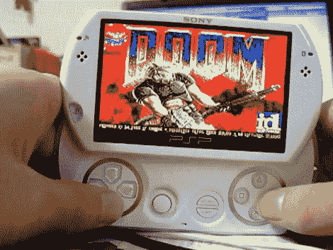

# 使用半字节加载程序的 PSP 自制软件

> 原文：<https://hackaday.com/2010/06/21/psp-homebrew-using-the-half-byte-loader/>

[Rich]向我们透露了关于半字节加载器的消息，它可以让你在新型号的索尼 PlayStation 笔记本电脑上运行自制程序。上面你可以看到一个 PSP Go 运行 Doom(休息后的视频截图)，这是任何破解设备的先决条件。HBL 在 Patapon 2 的游戏演示中使用了一个漏洞，可以免费下载。当从游戏的继续菜单中选择时，加载到记忆棒上的精心制作的游戏保存将使您进入加载器。目前，这种方法适用于所有已知的固件版本 5.0 及更高版本。谁知道索尼什么时候[会采取行动干掉像这样的漏洞](http://hackaday.com/2010/03/31/sony-removes-ps3-linux-support-with-an-update-errrrr-downgrade/)。

[https://www.youtube.com/embed/PlqaJmZJ7r8?version=3&rel=1&showsearch=0&showinfo=1&iv_load_policy=1&fs=1&hl=en-US&autohide=2&wmode=transparent](https://www.youtube.com/embed/PlqaJmZJ7r8?version=3&rel=1&showsearch=0&showinfo=1&iv_load_policy=1&fs=1&hl=en-US&autohide=2&wmode=transparent)