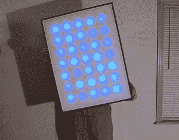

# 巨型 LED 矩阵

> 原文：<https://hackaday.com/2010/06/23/giant-led-matrix/>

我们都喜欢闪亮的灯。我们比 blinky lights 更喜欢的是一个非常详细的教程，里面有很棒的照片。[理查德·克兰]写了这篇精彩的教程，讲述如何[构建一个大型 5×7 LED 矩阵，并用 PIC 处理器](http://www.decadecounter.com/vta/articleview.php?item=879)控制它。主体是一块泡沫隔热板，上面覆盖着一个扩散器。源代码和原理图可从网站下载。如果你曾经想过进入 PIC 处理器，这将是一个伟大的初学者项目。

[via [MakeZine](http://blog.makezine.com/archive/2010/06/giant_led_matrix.html)