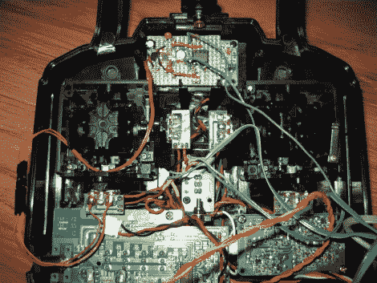

# 向 RC 发射器添加运动控制

> 原文：<https://hackaday.com/2010/06/25/adding-motion-control-to-an-rc-transmitter/>

如果你的焊接技术达到标准，你可以[给你的无线电控制发射器](http://starlino.com/rc_transmitter_accelerometer.html)增加一个运动控制功能。[Starlino]使用加速度计和陀螺仪组合模块作为模拟控制信息的替代来源。他制作了一个过滤器来调节模拟电压范围，以匹配控制器上的一个操纵杆。当不需要运动输入时，使用开关断开信号。这将是对那些[更有创意的空中黑客](http://hackaday.com/2009/12/30/uav-reigns-down-vengeance-upon-thee/)的一个很好的补充。