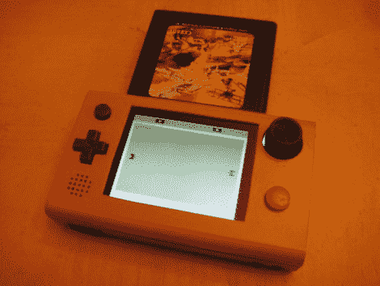

# 游戏机大小的便携式雅达利

> 原文：<https://hackaday.com/2010/06/26/portable-atari-the-size-of-a-game-boy/>

这台便携式雅达利(Atari)是(马里奥)努力的结果。核心系统是一个雅达利闪回 2，这是一个 2005 年发布的嵌入式系统，内置了几个游戏。股票游戏是不够的，所以[马里奥]增加了一个墨盒插槽，以便玩他想玩的任何游戏。这个盒子最初是 iPod touch 的包装，所以你知道它很结实。我们也喜欢在[工作日志](http://forums.benheck.com/viewtopic.php?f=1&t=38001)中看到的自由形式的音频放大器。有人知道闪回 2 有没有[暂停功能](http://hackaday.com/2010/06/22/update-atari-pause-button/)？