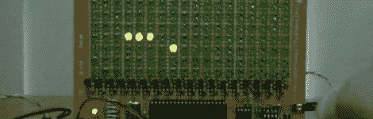
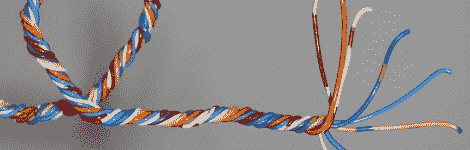

# 黑客日链接:2010 年 6 月 27 日

> 原文：<https://hackaday.com/2010/06/27/hackaday-links-june-27-2010/>

**精密显像管制造**

****

泰克公司有一个很棒的视频，是关于[制造精密阴极射线管](http://classictek.org/index.php?option=com_seyret&Itemid=100&task=videodirectlink&id=1)的。显像管制造方法被开发出来用于示波器，我们猜想它可以追溯到 20 世纪 60 年代早期

**LED 矩阵上的蛇**

****

我们本来可以做一个这个漂亮的 LED 矩阵的完整帖子，但是我们找不到太多关于它的信息。现在，[欣赏该设备玩经典游戏贪吃蛇的视频](http://www.youtube.com/watch?v=ICsi2mhrH94)。[感谢 Xdr]

**电线捆扎**

****

我们不确定这是聪明的还是仅仅是蛇油。这里有一种用电钻将电线缠绕在一起的方法。我们总是用我们的手，但我们也从来没有真正工作过。[感谢凯珀]