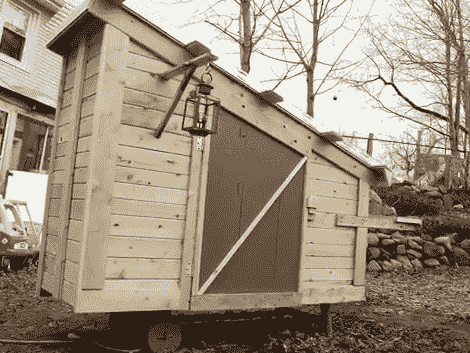

# 房屋将从剩余的废料

> 原文：<https://hackaday.com/2010/06/28/houses-to-go-from-leftover-scraps/>

[德里克·迪德里克森]用剩余的建筑材料建造游牧房屋。有些大到可以拖在汽车后面，或者，就上面的例子来说，小到可以像手推车一样搬运。我们喜欢它们，因为它们不仅重复利用了通常会被填埋的材料，而且看起来很好。休息过后，请看黄色房子系列的前几集。然后从(德里克的)成功中获得一些灵感，看看你的垃圾中是否已经有足够的东西来开始。

 <https://www.youtube.com/embed/GEvYT3CMtQI?version=3&rel=1&showsearch=0&showinfo=1&iv_load_policy=1&fs=1&hl=en-US&autohide=2&wmode=transparent>

 <iframe class="youtube-player" width="800" height="480" src="https://www.youtube.com/embed/LmR3kx660gw?version=3&amp;rel=1&amp;showsearch=0&amp;showinfo=1&amp;iv_load_policy=1&amp;fs=1&amp;hl=en-US&amp;autohide=2&amp;wmode=transparent" allowfullscreen="true" style="border:0;" sandbox="allow-scripts allow-same-origin allow-popups allow-presentation"/> 
[通过<a href="http://www.npr.org/templates/story/story.php?storyId=128109273" target="_blank"> NPR </a>匿名致谢]
 </body> </html>