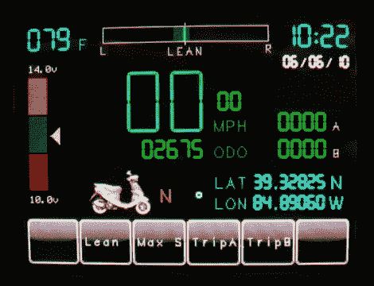

# 触摸屏踏板车电脑

> 原文：<https://hackaday.com/2010/06/28/touchscreen-scooter-computer/>

[Kurt]s[scooter 电脑](http://www.janspace.com/b2evolution/arduino.php/2010/06/26/scooterputer)开始是用几个发光二极管来显示他的猪的电池电量。它基于 Arduino，并使用分压器来判断还剩多少果汁。但后来他偶然发现了 Arduino 的触摸屏有机发光二极管盾，于是这个项目开始起步。现在，电池、温度、实时时钟和 GPS 在光滑的显示屏上运行。它可能不是一辆成熟的摩托车，但它给了[电脑接口](http://hackaday.com/2010/05/01/motorcycle%C2%A0computer/) [我们已经看到其他自行车的](http://hackaday.com/2010/05/05/vehicle-information-display-hacks/)一个机会。

[谢谢莫丘斯]