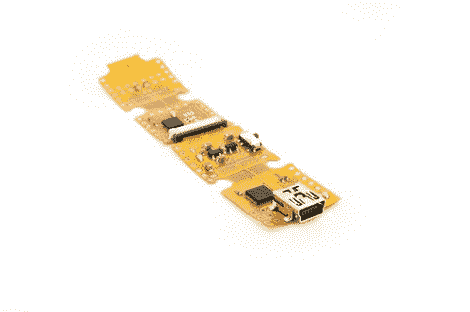

# FPC·阿尔杜伊诺

> 原文：<https://hackaday.com/2010/06/29/fpc-arduino/>

Seeed 工作室有一个 Arduino 的新版本，他们称之为 Seeeduino 电影。他们用树脂材料代替传统的玻璃纤维基板来生产[柔性印刷电路](http://www.electronics-manufacturers.com/products/electrical-electronic-components/printed-circuit-board-pcb/flexible-printed-circuit-fpc/) (FPC)。除了灵活性之外，他们的目标是保持这个原型的模块化。从图中我们可以看到，四个方块中的每一个都是 Arduino 系统中不同的组件。上面的照片在最近的节点上有 USB 接口，然后是电源调节器，微处理器，最后是剩余的外设连接。这种材料可以很容易地用剪刀剪开，这样一旦固件被刻录到芯片上，编程部分就可以被删除。看到最终的定价和包装选择将会很有趣。我们不介意周围有一个 FPC ATmega168 分线板，但特别是如果你[正在制作自己的手表](http://hackaday.com/2009/10/19/build-your-own-wristwatch/)，这将非常适合表带。

[谢谢胡安]