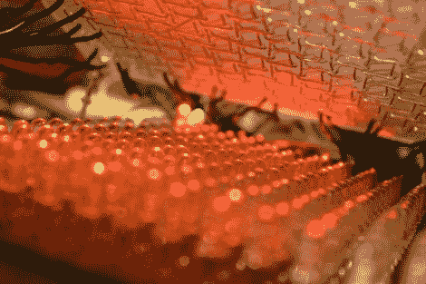

# 物理色调矩阵

> 原文：<https://hackaday.com/2010/06/30/physical-tone-matrix/>

[Andrew Jenner]用这个[物理音调矩阵](http://www.reenigne.org/blog/physical-tone-matrix/)完成了一些令人惊奇的事情。他想制作一个实体版的[，一个他见过的](http://lab.andre-michelle.com/tonematrix)flash 小程序。两层构成了主用户界面。顶层是一块丙烯酸板，作为触摸界面，下面是一个 LED 矩阵。[Andrew 的]触摸界面使用贯穿丙烯酸树脂的导线作为触点，通过晶体管对进行轮询。正如你在休息后的视频中看到的，它工作得很好，我们喜欢这样一个事实，即有一个触觉组件(由于凹凸不平的电线)，你在使用触摸屏工作时不会得到。

底层的 16×16 网格的发光二极管对应着触摸矩阵手上的每个‘按钮’有一些额外的功能，比如玩[康威的生命游戏](http://hackaday.com/2009/09/28/capacitive-buttons-control-all-life/)。这个神奇的建筑仍然有几个问题需要解决，最明显的是音频电路中的干扰，但我们对他快速取得的成就印象深刻。另外，这比单体更经济，也比我们见过的一些[单体克隆](http://hackaday.com/2010/01/12/arduinome-with-many-pots/)更大。

 <https://www.youtube.com/embed/JjCh9pMBwJI?version=3&rel=1&showsearch=0&showinfo=1&iv_load_policy=1&fs=1&hl=en-US&autohide=2&wmode=transparent>

 </body> </html>