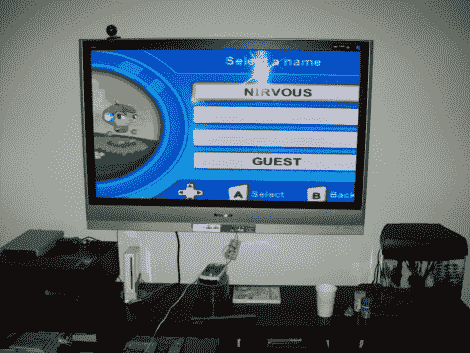

# DIDJ 复合视频输出

> 原文：<https://hackaday.com/2010/06/30/didj-composite-video-out/>

[Nirvous]设法在 DIDJ 上制作出[复合视频。他知道中央处理器有能力产生信号，并且类似的设备已经有这种能力。在研究了一些 DIDJ 拆卸之后，他发现处理器上的哪个连接应该提供适当的信号。接下来是固件方面的事情，在筛选了大量代码后，他很高兴地发现了一个标志，看起来它可以支持视频输出。一些交叉编译、焊接和低通滤波器使它工作。](http://rosincore.squarespace.com/journal/2010/6/29/didjumbotron.html)

如果你一直在使用设备进行黑客攻击，你可以试试这个。CPU 使用球栅阵列，所以焊接有点困难。我们介绍了[一个 BGA 焊接技巧](http://hackaday.com/2009/12/17/accessing-bga-pins/)，这可能正是你想要的，所以在你退回到你孤独的焊接堡垒之前，请检查一下。