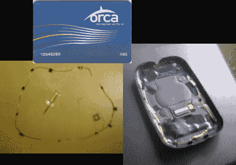

# RFID 移植

> 原文：<https://hackaday.com/2010/07/01/rfid-transplant/>

[扎克·查拉特]不想再随身携带另一张卡，所以他把卡上的 RFID 芯片移植到了他的手机上。将卡片浸泡在洗甲水中 12 个小时，他一无所获，但当他取出丙酮时，卡片在 30 秒内就分崩离析了。上面你可以看到抛弃塑料后留下的微小芯片和环形天线。黑色的部分是电子胶带，然后他用它将这个嵌入他的 Palm Pre 的 touchstone 充电器板(我们刚刚[在上周的一次黑客攻击中看到这个](http://hackaday.com/2010/06/21/inductive-charging-for-the-htc-evo/))。

这很有效，当你在等待世界实施[陈峰达拉斯多通道](http://www.youtube.com/watch?v=eV_eGm1qgGs)时，这是一个很好的解决方案。

[感谢 covered wagon kid via[Pre Central](http://www.precentral.net/rfid-chip-transplanted-pre-works-4)