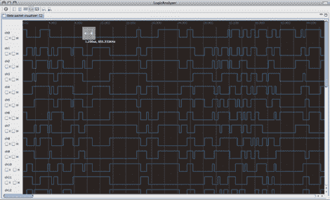

# 开源逻辑分析仪软件

> 原文：<https://hackaday.com/2010/07/01/open-source-logic-analyzer-software/>

[Christian Weichel]一直在努力开发 logical analyzer，这是一款开源工具，你可能会感兴趣。它是用[集水坑逻辑分析仪](http://www.sump.org/projects/analyzer/)设计的，但主要目标是可扩展性。这意味着它可以很好地与像[开放工作台逻辑嗅探器](http://hackaday.com/2010/02/28/open-source-logic-analyzer-2/)这样的东西配合使用，或者你可以做一些小改动让它与你自己的设计配合使用。这个程序是基于 Eclipse 的，所以你应该熟悉它是如何工作的，你可以很容易地让它在多个平台上运行。看一看 wiki 来快速开始。