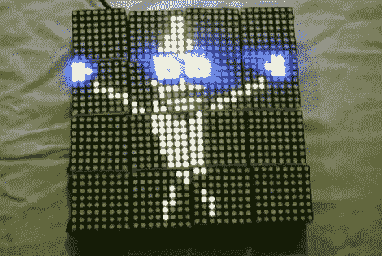

# 伟大的互动 LED 拼图

> 原文：<https://hackaday.com/2010/07/02/great-interactive-led-puzzle/>

GLIP 项目将闪烁的发光二极管的乐趣与模块化通信的独创性结合起来。这让[的困惑概念](http://hackaday.com/2008/05/09/maker-faire-2008-puzzlemation/)更进了一步。在那个项目中，模块是通过一个基站编程的，可以从那里取出来用作拼图。GLIP 项目使用了一个主模块，你可以在照片中看到。但是这些块通过红外协议相互通信。这样，当它们彼此相邻放置时，它们可以被连续更新。每个模块都包括一个 STM32F105 ARM Cortex-M3 处理器，对于小模块来说相当强大。休息之后看看他们能做些什么。

 <https://www.youtube.com/embed/tPrO4Gg0kNM?version=3&rel=1&showsearch=0&showinfo=1&iv_load_policy=1&fs=1&hl=en-US&autohide=2&wmode=transparent>

 
[Thanks Skappy]
 </body> </html>