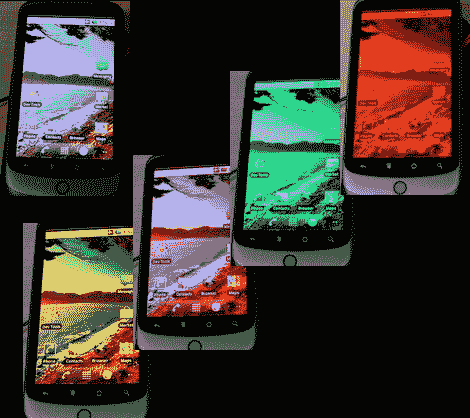

# 有机发光二极管·哈克在 Nexus One 上节省了电量

> 原文：<https://hackaday.com/2010/07/02/oled-hack-saves-juice-on-nexus-one/>

想真正延长手机的电池寿命吗？如果你有一个有机发光二极管显示器[杰夫·夏基]可能有答案。他用他的 Nexus One 做了一些测试，看看颜色变化是否可以节省电流。颜色越深消耗的电流越少，他发现红色像素效率最高。他用 [SurfaceFlinger](http://source.android.com/porting/display_drivers.html) 做了一点工作，它处理 Android 设备上的显示，使这变得容易，但是变成红色会得到什么呢？他测量到，仅使用红色像素会将当前使用降低到全色显示器的 35%。这让我们想起了那些通过谷歌 T5 运行黑色背景来[节能的努力。不管你是否使用它，他的文章都是一个有趣的读物。](http://ecoiron.blogspot.com/2007/01/black-google-would-save-3000-megawatts.html)