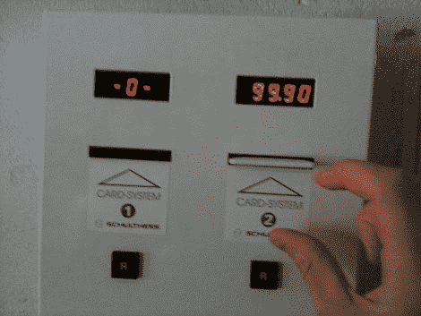

# 免费洗衣 Redux

> 原文：<https://hackaday.com/2010/07/03/free-laundry-redux/>

[考拉]担心他的[伪智能卡把戏](http://life-is-a-hack.blogspot.com/2010/07/free-laundry-for-everybody.html)不会被认为是有价值的。我们更担心网络警察会发现这篇文章，让我们都被涂上柏油和羽毛。

玩笑归玩笑，看起来自助洗衣店的老板肯定没有吸取教训。长话短说，使用一个总线盗版者和一些我们在[之前见过的](http://hackaday.com/2009/07/30/black-hat-2009-parking-meter-hacking/)智能卡黑客技术【考拉】能够在他的伪智能卡上写他需要的任何数量；从而给他一个[的免费洗衣量](http://hackaday.com/2008/10/12/free-laundry/)。