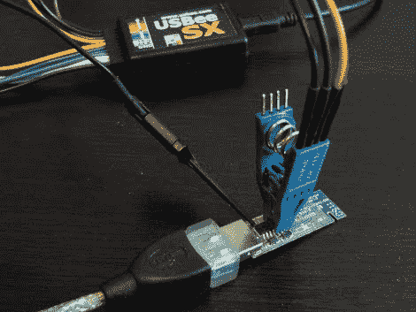

# 无线演示者容易被破解

> 原文：<https://hackaday.com/2010/07/04/wireless-presenters-easily-cracked/>

虽然[黑掉一个无线演示者](http://blog.teusink.net/2010/07/hacking-wireless-presenters-with.html)听起来并不值得或有趣，但【Niels Teusink】证明了这些小设备往往比我们想象的要强大得多。

通过 Arduino、大量的研究和对无线演示者的 SPI 的大量嗅探，无线接口[Niels]能够模拟整个键盘。将无害的命令“下一张幻灯片”发送到毁灭性的“[Win+R] Format C:”中。希望在下一次苹果或微软的主题演讲中计划这样一个项目的人只是想要一些温和的乐趣。

相关:[无线键盘易破解](http://hackaday.com/2007/12/02/wireless-keyboards-easily-cracked/)。

[谢谢丹·兰森]