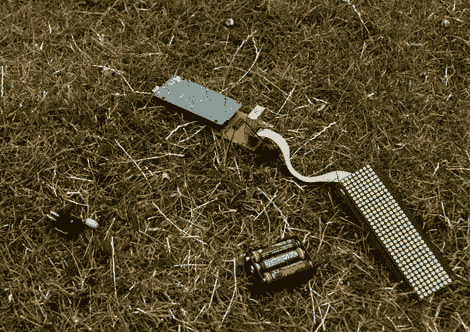

# Arduino 空间计划

> 原文：<https://hackaday.com/2010/07/14/arduino-space-program/>

随着最近向美国国家航空航天局提出的削减，我们在英国北安普顿的朋友们决定采取行动，开展他们自己的太空计划……至少是小规模的。北安普顿的黑客空间 NortHACKton 决定举办一次火箭日，由化学反应驱动的火箭、加压水瓶组成，甚至还有一个采用了 [Arduino 控制发射系统](http://northackton.stdin.co.uk/blog/2010/07/arduino-rocket-launcher/)，类似于我们在过去的 [中](http://hackaday.com/2008/03/24/wireless-fireworks-controller/)[看到的](http://hackaday.com/2008/11/15/microcontroller-fireworks-launcher/) [。它主要由倒计时和自动点火系统组成。原理图和源代码可供那些足够冒险的人开始自己的任务。](http://hackaday.com/2008/10/14/microcontroller-powered-missile-launch-controller/)