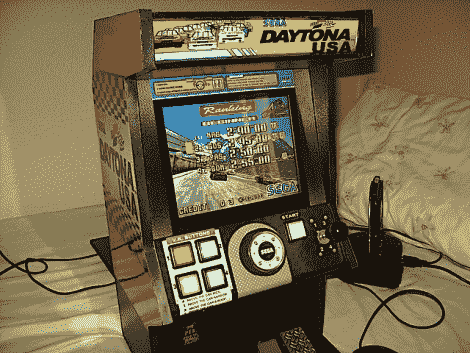

# 迷你赛车柜

> 原文：<https://hackaday.com/2010/07/06/mini-racing-cabinet/>

这里还有一个[小街机柜](http://www.retrovicio.com/foro/showthread.php?t=10456)。这一次是赛车模拟器美国代托纳。[Pocket_lucho 的] [内阁工作在](http://hackaday.com/2009/09/04/mini-mame-cabinet/)之前就已经开始了，他在这个版本的控制界面上做了一些精细的工作。轮子来自遥控汽车的控制器，变速杆来自一个经常使用的玩具。他用门铰链和几个叶片开关制作了两个踏板。胆量包相当出拳与迷你 ITX 主板运行显示。这个放在[吃豆人](http://hackaday.com/2010/05/30/child-sized-cocktail-cabinets/)旁边会很好看。休息之后请看视频。

 <https://www.youtube.com/embed/BNHYtaiDs_8?version=3&rel=1&showsearch=0&showinfo=1&iv_load_policy=1&fs=1&hl=en-US&autohide=2&wmode=transparent>

 </body> </html>