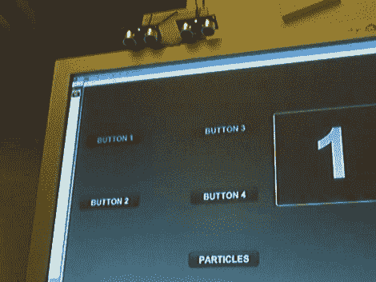

# 使用距离传感器的触摸屏

> 原文：<https://hackaday.com/2010/07/07/touch-screen-using-range-sensors/>

这个[触摸屏依靠两个测距仪](http://jamesalliban.wordpress.com/2008/06/06/arduino-flash-range-sensor-experiment/)的测量来跟踪你按下按钮时的手指。[James Alliban]将这些放在一起作为他的第一个 Arduino 项目。我们熟悉[詹姆斯]的背景，因为他的信息丰富的[增强现实名片](http://hackaday.com/2009/07/15/augmented-reality-business-card/)。当 Arduino 从测距仪获取数据时，它会将数据发送到运行在 PC 上的 Flash 脚本。

当我们在休息后观看视频时，许多问题浮现在脑海中。这些 Ping 传感器有什么样的角度？如果它们互相垂直放置会有干扰问题吗？如果它们不都在屏幕上方，你会得到更准确的数据吗？目前这只是一个初步的实验，但我们喜欢这个概念，可能会自己尝试一下。

<https://player.vimeo.com/video/1125833>

 
[谢谢胡安]
 </body> </html>