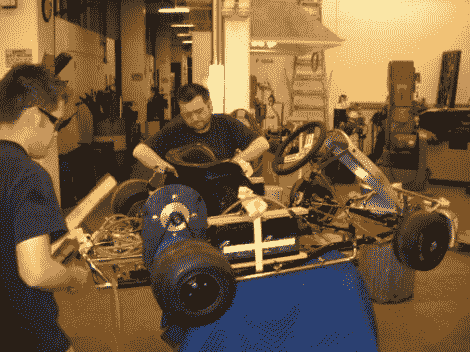

# 建造电动卡丁车

> 原文：<https://hackaday.com/2010/07/08/building-an-electric-kart/>

[亨利·赫恩登]正在用剩余零件建造一辆电动卡丁车。他已经[获得了一些电动汽车的经验](http://hackaday.com/2010/02/15/converting-a-miata-to-all-electric/)，但这并不意味着建造会一帆风顺。到目前为止，他已经想出了一个办法[让独特的电机轴与他的钻机配合得很好](http://acuteaero.com/2010/06/16/breaking-and-fixing-the-mars-bldc-brushless-motor/)，但是一旦所有东西都组装好了，他就遇到了链条从齿轮上脱落的问题。

我们知道到目前为止这里有很多链接，但还有几个:[亨利]在添加马达之前拍了一些卡丁车底盘的照片，为了好玩，看看[的透明胶带分配器](http://acuteaero.com/2010/06/03/the-most-advanced-scotch-tape-dispenser-in-the-world/)。当你完成点击这些后，加入我们的休息，一些试驾镜头。

 <https://www.youtube.com/embed/pzLCLKqZYl0?version=3&rel=1&showsearch=0&showinfo=1&iv_load_policy=1&fs=1&hl=en-US&autohide=2&wmode=transparent>

 
[感谢 FaultyWarrior]
 </body> </html>