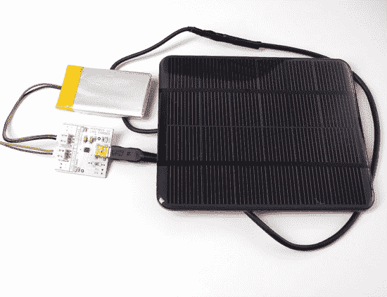

# 太阳能微型助推器

> 原文：<https://hackaday.com/2010/07/10/solar-mintyboost/>

我们[第一次写](http://hackaday.com/2006/05/31/minty-boost-aa-based-usb-charger/)是在 2006 年。今天，Adafruit 创建了一个制作[太阳能迷你机器人](http://www.adafruit.com/blog/2010/07/09/how-to-make-a-solar-mintyboost-a-solar-power-charger-for-your-gadgets/)的教程。使用一个[微型助推器](http://www.adafruit.com/index.php?main_page=product_info&cPath=10&products_id=14)，一个[太阳能电池板](http://www.adafruit.com/index.php?main_page=advanced_search_result&search_in_description=1&keyword=solar)，[脂肪电池](http://www.adafruit.com/index.php?main_page=product_info&cPath=44&products_id=258)和一个[充电器](http://www.adafruit.com/index.php?main_page=product_info&cPath=44&products_id=259)，他们建立了他们的[太阳能脂肪教程](http://ladyada.net/make/solarlipo/)。他们将 LiPoly 充电器的电源输出馈入 MintyBoost 的电池输入，为 USB 设备进行电压升压。基于使用 SparkFun 零件的[说明书](http://www.instructables.com/id/How-to-make-a-solar-iPodiPhone-charger-aka-Might/step1/Tools-and-materials/),本教程展示了如何使用可从一个来源获得的零件。我们听说 MintyBoost 将会有一些改进，包括充电功能。