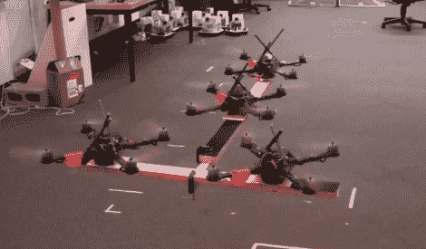

# 更新:杂技四轴飞行器组队

> 原文：<https://hackaday.com/2010/07/12/update-acrobatic-quadcopters-team-up/>

当我们想到群体机器人时，我们通常会想到小型轮式机器人，但这些合作的四轴飞行器让我们重新思考。这是同一个项目的延伸，该项目制作了那些令人印象深刻的空中杂技。它可能不那么华丽，但看着一群群四旋翼飞行器抓住并提升负载是相当令人印象深刻的。还有一个镜头是一个掉了一个 2×4，马上补偿掉的体重。我们还不确定，但看起来团队起重不需要杂技演员那样的 20 高速摄影设备。休息之后我们嵌入了演示视频。

 <https://www.youtube.com/embed/YBsJwapanWI?version=3&rel=1&showsearch=0&showinfo=1&iv_load_policy=1&fs=1&hl=en-US&autohide=2&wmode=transparent>

 
[谢谢巴尔伯]
 </body> </html>