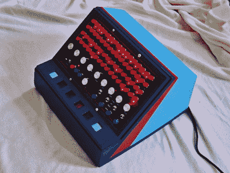

# 可编程鼓形机

> 原文：<https://hackaday.com/2010/07/12/programmable-drum-machine/>

这个音序器叫做[鼓声器](http://www.mysterycircuits.com/drumssette/drumssette.html)，它使用录音带来制造一些节拍。[迈克·沃尔特斯]围绕着一台 Tascam 四轨盒式录音机做了这个。里面的磁带在每个轨道上都有不同的鼓声，并有相应的一排红色按钮。按下按钮会将鼓声添加到该节拍的循环中。他使用一系列数字逻辑门来修补声音，同时从磁带的一个轨道为设备计时。看到视频中的焦点选择器在休息后同步重复的鼓模式的开始是非常整洁的。这不是我们第一次看到[迈克的]作品。如果你去年错过了，花点时间回顾一下[梅乐曼](http://hackaday.com/2009/12/04/melloman-tape-looping-keyboard-2/)。

 <https://www.youtube.com/embed/vaK_oTPIxNY?version=3&rel=1&showsearch=0&showinfo=1&iv_load_policy=1&fs=1&hl=en-US&autohide=2&wmode=transparent>

 
硬件走查
 <iframe class="youtube-player" width="800" height="480" src="https://www.youtube.com/embed/spp2m0t2jxg?version=3&amp;rel=1&amp;showsearch=0&amp;showinfo=1&amp;iv_load_policy=1&amp;fs=1&amp;hl=en-US&amp;autohide=2&amp;wmode=transparent" allowfullscreen="true" style="border:0;" sandbox="allow-scripts allow-same-origin allow-popups allow-presentation"/> 
音频演示
 </body> </html>