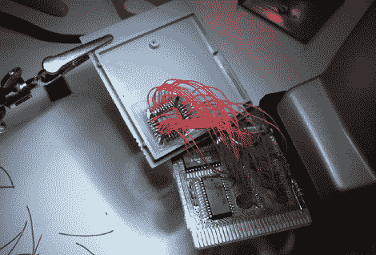

# 可编程游戏机盒走过

> 原文：<https://hackaday.com/2010/07/14/programmable-game-boy-cartridge-walk-through/>

我们在五月看了一下【Gerry 的】基于 PLCC 的可编程 Game Boy cartridge [，并提到他正在制作一个如何操作的视频。他做的远不止这些。他为](http://hackaday.com/2010/05/26/plcc-replaces-game-boy-cartridge-rom/)[制作了 PDF 版本的说明](http://www.digital-circuitry.com/DOC/NINTENDO/GAMEBOY/DIY%20Nintendo%20GAMEBOY%20Classic%20Flash%20Cartridge.pdf)，但在[的 YouTube 频道](http://www.youtube.com/user/NLEproGUY)上收集了四个视频，对细节进行了深入研究。休息之后我们已经植入了所有四个。它们包括关于墨盒的介绍和背景，拆焊 ROM 芯片，准备插座和电线，以及进行焊接连接。不管你是否对这种特殊的黑客技术感兴趣，看看[Gerry 的]焊接实践就知道这些视频值得一看。

 <https://www.youtube.com/embed/08sBZSciXWk?version=3&rel=1&showsearch=0&showinfo=1&iv_load_policy=1&fs=1&hl=en-US&autohide=2&wmode=transparent>

 
简介和墨盒背景
 <iframe class="youtube-player" width="800" height="480" src="https://www.youtube.com/embed/KIRMON1e93s?version=3&amp;rel=1&amp;showsearch=0&amp;showinfo=1&amp;iv_load_policy=1&amp;fs=1&amp;hl=en-US&amp;autohide=2&amp;wmode=transparent" allowfullscreen="true" style="border:0;" sandbox="allow-scripts allow-same-origin allow-popups allow-presentation"/> 
从旧墨盒上拆下 ROM
 <iframe class="youtube-player" width="800" height="480" src="https://www.youtube.com/embed/x0E2G9DZtfM?version=3&amp;rel=1&amp;showsearch=0&amp;showinfo=1&amp;iv_load_policy=1&amp;fs=1&amp;hl=en-US&amp;autohide=2&amp;wmode=transparent" allowfullscreen="true" style="border:0;" sandbox="allow-scripts allow-same-origin allow-popups allow-presentation"/> 
准备芯片插座和电线
 <iframe class="youtube-player" width="800" height="480" src="https://www.youtube.com/embed/P4pIjXo845Y?version=3&amp;rel=1&amp;showsearch=0&amp;showinfo=1&amp;iv_load_policy=1&amp;fs=1&amp;hl=en-US&amp;autohide=2&amp;wmode=transparent" allowfullscreen="true" style="border:0;" sandbox="allow-scripts allow-same-origin allow-popups allow-presentation"/> 
将电线焊接到焊盘上
 </body> </html>