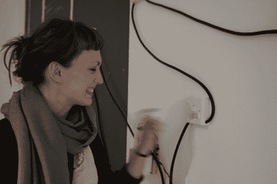

# 那个电灯开关真恶心！

> 原文：<https://hackaday.com/2010/07/15/that-light-switch-is-disgusting/>

[Katrin Baumgarten]有 14 个让你恶心的开关。从一个当你的手指接近时会缩进洞里的按钮，到一个神秘的渗出粘液的面板，到一个当你试图翻转它时会被唤醒的毛茸茸的外壳，这种阴谋足以让你尝试网络中的下一个令人毛骨悚然的节点。休息后有几个不同开关的剪辑，如果这还不够，她在[她的 Vimeo 频道](http://vimeo.com/user4215300)还有更多。

<https://player.vimeo.com/video/13361854>

 </body> </html>