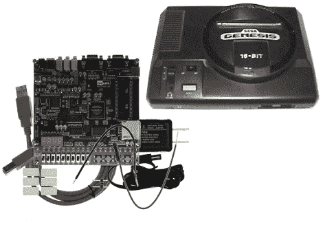

# 用 FPGA 克隆的 SEGA 创世纪

> 原文：<https://hackaday.com/2010/07/16/sega-genesis-cloned-with-an-fpga/>

[格雷格]成功地用现场可编程门阵列克隆了一个 SEGA 起源。在开发过程中，他使用了 Terasic/Altera DE1 板，这将花费您大约 160 美元。板载按钮目前用作显示器的 VGA 控制器。谁知道呢，也许还有足够的编程空间让[驱动一个 PSP 屏幕](http://hackaday.com/2009/12/12/fpga-driver-for-psp-screen/)并把它变成一个掌上电脑？

休息之后你可以看到一些游戏片段。如果 SEGA 从来不是你的菜，别忘了还有一个 [NES FPGA 黑客](http://hackaday.com/2009/10/17/nes-processor-cloned-on-a-fpga/)也在那里。

[https://www.youtube.com/embed/ilzKiW21T9Y?version=3&rel=1&showsearch=0&showinfo=1&iv_load_policy=1&fs=1&hl=en-US&autohide=2&wmode=transparent](https://www.youtube.com/embed/ilzKiW21T9Y?version=3&rel=1&showsearch=0&showinfo=1&iv_load_policy=1&fs=1&hl=en-US&autohide=2&wmode=transparent)

[创世纪[图片来源](http://arcona.wordpress.com/2008/12/05/the-games-ive-beaten-list/)

[DE1 [图片来源](http://search.digikey.com/scripts/DkSearch/dksus.dll?WT.z_header=search_go&lang=en&site=us&keywords=altera+de1&x=0&y=0)