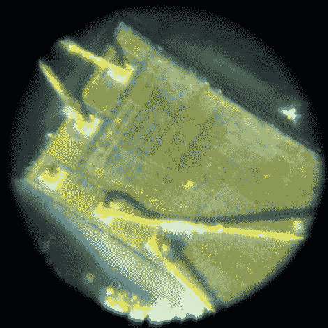

# 用 Sap 对集成电路解封

> 原文：<https://hackaday.com/2010/07/16/decapping-integrated-circuits-with-sap/>

【詹姆斯】对[逆向工程一些集成电路](http://s3cu14r.wordpress.com/2010/07/15/boiling-chips-in-tree-sap/)感兴趣。在这一过程中，最大的障碍之一一直是进入芯片的内部。他用丙酮溶解塑料外壳，但很难穿过环氧树脂。通常，[环氧树脂被浸泡在硝酸中](http://hackaday.com/2008/05/31/silicon-hacking/)几分钟，但是【詹姆斯】没有接触到这种化学物质。相反，他去了当地的音乐商店，买了一些松香(用来使小提琴弓足够粘以抓住乐器的弦)。将硬如岩石的松香和芯片煮沸 20 分钟后，他得到了一个干净且相对完好的半导体，他可以很容易地窥视到它。