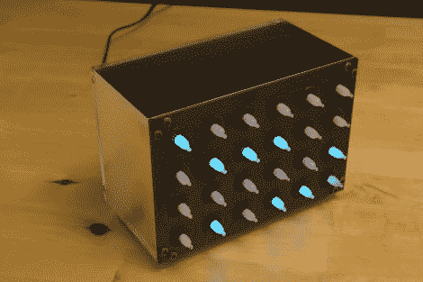

# 氖二进制时钟

> 原文：<https://hackaday.com/2010/07/16/neon-binary-clock/>

[Josiah]对发光二极管说“不”,而是使用蓝色磷光体霓虹灯来建造这个二进制时钟。内部的 ATmega328 使用三个 8 位移位寄存器来控制显示。每盏灯都需要一个高压 NPN 晶体管来接通正常照明所需的 150V 电压。一个简单的电路用于从输入的 16v 交流电源中提取 60 Hz 时钟信号。不幸的是，它有点太简单，没有提供一个清晰的信号。[Josiah 的]解决方法是固件中的去抖子程序，以防止下降沿出现多次中断。

我们从[Josiah]那里看到的最后一个项目是[科切拉灯](http://hackaday.com/2010/06/19/coachella-lamp/)。那是一件过时技术的展示品，而这是另一件极简风格的展示品。我们也喜欢看到原型板在内部工作。这是一个非常拥挤的电路板，当你用焊料滴构建每条迹线时，保持一切都在正确的位置是一个不小的壮举。