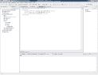
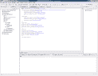
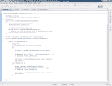

# 机器人开发 101-第 2 部分:图形元素

> 原文：<https://hackaday.com/2010/07/19/android-development-101-part-2improved-hello-world/>


在本教程中，我们将从上次停止的地方继续学习“ [hello world](http://hackaday.com/2010/07/15/android-dev-101-%E2%80%93-part-1hello-world/) ”应用程序。这次添加了一个图形用户界面(GUI)和一个“吐司”。GUI 将由一个按钮、文本框和标签组成。当按下按钮时,“祝酒词”会出现在屏幕上。

有些人可能想知道什么是祝酒词。好吧，对于非程序员来说，toast 是一种文本通知，在很大程度上仅用于在屏幕上显示错误(我非常喜欢使用 toast 而不是在屏幕上显示警告，因为它更少打扰)。在本文中，我们将使用 toast 在屏幕上显示一条消息，该消息将接受文本框中的文本，并在屏幕底部发出“Hello Greg”。完成本文后，您将能够成功地制作 toast 命令，设计 hello world 程序的布局，并从文本框中提取文本。

我们将从复制现有的 Hello World 项目开始，这样我们可以在各个方面使用原始项目，但有两个单独的项目来显示差异，两个项目都可以用作参考。为此，我们将在右侧窗格(导航浏览器)中右键单击我们的 **HelloWorld** 项目的根目录，导航到 copy ( *而不是***Copy Qualified Name**)并单击它。然后在导航浏览器中找到一个空白处，再次右键单击并单击粘贴。您将被要求为此项目提供一个新名称，以及是否使用默认位置。我们将这个新项目命名为**improvedheloworld**,我们将选中复选框“使用默认位置”。按 **OK** 新项目将从旧项目生成。

[](http://hackaday.com/wp-content/uploads/2010/07/strings1.png)

我们要完成的第一件事是更改 *strings.xml* 文件，在 *app_name* 下添加另一个节点。我们将复制它上面的节点，并将复制的材料直接粘贴到最后一个 *< /string >* 元素下面。然后我们将字符串的名称改为 press，在中间我们将写 **Press Me！**。接下来，我们将更改 **hello** 节点，并将文本改为**在此输入您的姓名:**而不是 **Hello Android，Hello World！**。完成后，我们现在需要设计 GUI(图形用户界面)。

[](http://hackaday.com/wp-content/uploads/2010/07/main1.png)

要做到这一点，请导航到 main.xml，我们将回顾到目前为止的所有操作。我们首先有一个名为 **LinearLayout** 的节点，它基本上为添加文本框、按钮等对象创建了一个空间，并将为我们格式化布局。因此，LinearLayout 将在一列一行类型的交易中一件事情接一件事情地组织起来。接下来我们有一个**文本视图**，在任何其他标签中我们都可以称之为标签。现在，让我们回顾一下刚才提到的节点中的所有参数。**Android:layout _ width**&**Android:layout _ height**用于确定一个对象在布局中使用时会发生什么。使用时有两个选项，它们是 *fill_parent* 或 *wrap_content* 。 *fill_parent* 将完全按照它所说的那样做，它将调整对象的大小，使其垂直或水平填充屏幕。 *wrap_content* 将对象格式化，以扩展或缩小到显示内容的大小。这两个变量可以用于许多不同的对象，包括但不限于**布局**、**文本视图**、**文本框**和**按钮**。android:文本用于某些对象，如文本视图和文本框，向用户显示文本。现在，我们向用户显示文本，但是从 strings.xml 调用它，而不是在节点本身输入文本。要引用 *strings.xml* 所需要做的就是将 *@string/pres* s 放在引号内，其中 pres 是变量的名称。

现在我们已经熟悉了这些术语，我们需要修改它，首先放置一个标签、文本框，最后放置一个按钮。为此，我们将简单地添加一个文本框和按钮，因为我们已经处理了 *string.xml* 中的标签。要添加一个文本框，我们将在 *<文本视图/ >* 节点的结尾下另起一行。为了清楚起见，我将内联添加代码，并解释为什么我们要在之后添加它。**EditText Android:id = " @+id/hello name " Android:layout _ width = " fill _ parent " Android:layout _ height = " wrap _ content "/>。在这个实例中，EditText 将是我们的 textbox。此外，当给项目一个 ID 时，最好遵循在变量名前添加 **@+id/** 的做法，这样可以与您的*绑定。java* 文件以后。接下来我们将直接在我们的 *EditText* 节点的结尾下面添加 **<按钮 Android:id = " @+id/go " Android:layout _ width = " fill _ parent " Android:layout _ height = " wrap _ content " Android:text = " @ string/press "/>**。注意，我们引用了 *string.xml* 并调用了表示 **Press Me 的节点！**现在会出现在我们的按钮上。如果你现在运行这个项目，你将能够看到我们刚刚制作的程序的布局，但我们不能让它做任何事情，除了在文本框中输入文本。**

下一节将包含大量代码，我将提供大部分代码的截图来帮助你。首先，意识到每次你想在你的布局中引用一个对象时，我们需要导入它是很好的。我们需要为我们的按钮和文本框添加导入。我们可以通过将这些代码行添加到顶部的导入部分来实现:

```

import android.widget.Button;
import android.widget.EditText;

```

之后，我们将需要包括四个更多的导入，第一个是事件监听添加到我们的按钮，第二个是当事件处理程序运行时我们将调用的 toast，第三个是应用程序的上下文，第四个是获取应用程序的视图并处理布局和交互。这些导入可以添加到前面的导入下，如下所示:

```

import android.view.View.OnClickListener;
import android.widget.Toast;
import android.content.Context;
import android.view.View;

```

将这些添加到你的导入之后，我们就可以开始为我们的按钮和 onCreate 函数编写事件处理程序了，程序启动时会调用这个函数。为了使事情变得更简单，并补充截图，我将发布其余的代码，并解释重要的行在做什么，以及我们为什么要使用它们。

```

public class HelloMain extends Activity {
EditText helloName;

```

 **我们在任何函数上方创建一个对文本框的引用，这样它只需声明一次，但如果需要的话可以实例化多次。**

```

/** Called when the activity is first created. */
@Override
public void onCreate(Bundle savedInstanceState)
{
super.onCreate(savedInstanceState);
setContentView(R.layout.main);
// Capture our button from layout
Button button = (Button)findViewById(R.id.go);
// Register the onClick listener with the implementation above
button.setOnClickListener(mAddListener);
}

```

上面我们使用一个变量从布局中捕获按钮。对于这个变量，我们将为它分配一个 onClick 事件处理程序，如上面最后一行所示。下面我们为它创建一个事件处理程序，以便与上面的挂钩。创建这个函数后，它将能够从文本框中拉出文本，并用静态文本显示它。

```

// Create an anonymous implementation of OnClickListener
private OnClickListener mAddListener = new OnClickListener()
{
public void onClick(View v)
{
long id = 0;
// do something when the button is clicked
try
{
helloName = (EditText)findViewById(R.id.helloName);

```

这里，我们实例化了前面声明的 TextBox，并通过我们给它的 ID 找到它，从而在布局中捕获它。

```

Context context = getApplicationContext();
CharSequence text = &quot;Hello &quot; + helloName.getText() + &quot;!&quot;;
int duration = Toast.LENGTH_LONG;
Toast toast = Toast.makeText(context, text, duration);
toast.show();

```

上面的代码将获取上下文(我们的应用程序环境的方面),并将其与我们的动态 CharSequence 文本和 Toast 将在屏幕上显示的长度一起添加到我们的 Toast 中，在这种情况下，我们希望它更长。关键是要注意如何祝酒，因为向用户弹出文本框更有效，也更少分散注意力。

```

}
catch (Exception ex)
{
Context context = getApplicationContext();
CharSequence text = ex.toString() + &quot;ID = &quot; + id;
int duration = Toast.LENGTH_LONG;
Toast toast = Toast.makeText(context, text, duration);
toast.show();
}
}
};
}

```

我们为这个函数做的最后一件事是将上面提到的所有重要内容放入一个 try catch 语句，该语句将尝试我们的重要代码，如果有错误，它将显示一条提示消息，让我们知道有一个错误。对于诸如此类的函数，采取预防措施来捕捉错误而不强制关闭程序是至关重要的。在考虑 UI 和任何可能出现的错误消息时，把用户放在第一位是很重要的。如果一个错误不知何故溜进了你的程序，try catch 语句将捕捉这个错误，并使它对用户来说“可爱而模糊”。

代码的上半部分:

[](http://hackaday.com/wp-content/uploads/2010/07/ihw-11.png) 
下半部分代码，由之前查看的代码经过:

[](http://hackaday.com/wp-content/uploads/2010/07/ihw-21.png)

在我们为我们的。java 文件，我们现在可以继续运行应用程序并查看我们完成的改进的 Hello World 程序。请注意，当您按下按钮并且文本框中没有文本时，程序仍将正常运行。这是一个很好的特性，这样你就不会开始看到包含错误信息的祝酒词。按下按钮时，完成的产品应该是这样的:

这将结束我们改进的 Hello World 示例，但是学习还远远没有结束。下一篇文章，我们将研究数据库，研究一些简单的查询，并从头开始构建数据库。和往常一样，如果你对这篇文章的编码有任何问题，请留下你的评论，我会尽一切可能帮助你！如果你等不及下一个帖子，你可以在下一个帖子之前在[的数据库](http://developer.android.com/guide/topics/data/data-storage.html#db)上好好阅读。下次见，黑客快乐！

继续第 3 部分:[数据库介绍](http://hackaday.com/2010/07/21/android-development-101-part-3introduction-to-databases/)

43.002684-81.21499