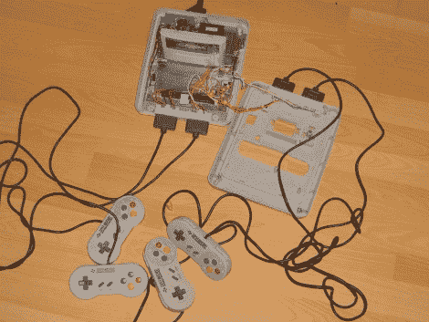

# 四人 SNES 和更多

> 原文：<https://hackaday.com/2010/07/20/4-player-snes-and-more/>

[X 先生]通过内部化多玩家适配器，为他的超级任天堂([谷歌翻译](http://translate.google.com/translate?js=y&prev=_t&hl=en&ie=UTF-8&layout=1&eotf=1&u=http://www.project-casemod.de/modules/newbb/viewtopic.php%3Ftopic_id%3D654&sl=de&tl=en))增加了对四个控制器的支持。在休息后的视频中，你会注意到他还通过将电源 LED 放置在徽标下方并添加了一个两位数显示屏，为外壳增添了一些光彩。背面有一个开关，允许他根据显示屏上显示的当前设置选择 PAL 或 NTSC 标准。虽然大多数人都在使用仿真器，但[X 先生]最终使用了定制的硬件。

 <https://www.youtube.com/embed/GmtiLpopevs?version=3&rel=1&showsearch=0&showinfo=1&iv_load_policy=1&fs=1&hl=en-US&autohide=2&wmode=transparent>

 </body> </html>