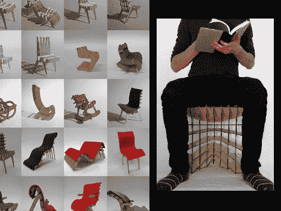

# 快速家具原型制作

> 原文：<https://hackaday.com/2010/07/20/rapid-furniture-prototyping/>

[SketchChair](http://gregsaul.co.nz/SketchChair/) 是一款让工程师脱离工程家具的软件。在一个孩子的梦想成真中，你画出你想要的轮廓，加上几条腿，软件就会弹出一个可以激光切割的设计。添加棕榈纤维和毛毡的点睛之笔产生了我们想象的适度舒适的坐姿。现在困难的部分将是说服你的配偶，你应该花这笔钱建立一个工业级激光切割机，因为所有的钱你会节省家具。

我们仍然坚持用 3d 打印的岩石家具来匹配我们的燧石族主题。

哦，和往常一样，休息后的视频。

<https://player.vimeo.com/video/9488518>

 
[通过<a href="http://www.buildlog.net/blog/2010/07/sketch-chair/" target="_blank">构建日志</a>
 </body> </html>