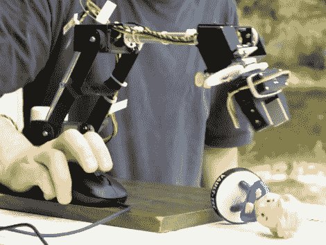

# 鼠标控制的机械手

> 原文：<https://hackaday.com/2010/07/22/mouse-controlled-manipulator-arm/>

[Oleg]想出了一个办法，用他的 [USB 鼠标来控制这个机械臂](http://www.circuitsathome.com/mcu/programming/controlling-robotic-arm-with-arduino-and-usb-mouse)。使用 Lynxmotion AL5D ( [我们以前见过 AL5A】)他用 Arduino 伺服盾驱动六个伺服系统。USB 主机保护罩处理 HID 端，用于连接鼠标。休息后的视频说明了一切，[奥列格]快速准确地捡起那个小雕像没有问题。滑动鼠标控制所有方向的水平移动。滚轮上下移动爪。按住左或右按钮，使用控制轮关闭或旋转爪。我们只能说:更大，](http://hackaday.com/2010/04/14/robotic-chess-opponent/)[更大](http://hackaday.com/2009/09/08/hand-of-man-mechanical-claw/)！

[https://www.youtube.com/embed/nz_tgDD8FNw?version=3&rel=1&showsearch=0&showinfo=1&iv_load_policy=1&fs=1&hl=en-US&autohide=2&wmode=transparent](https://www.youtube.com/embed/nz_tgDD8FNw?version=3&rel=1&showsearch=0&showinfo=1&iv_load_policy=1&fs=1&hl=en-US&autohide=2&wmode=transparent)