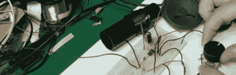

# 黑客日链接:2010 年 7 月 25 日

> 原文：<https://hackaday.com/2010/07/25/hackaday-links-july-25-2010/>

**无线电接收器**

如果你小时候没有机会制作一个，JoOngle 会带你一步步制作你自己的收音机。细节有点匮乏，但你的朋友谷歌可以帮你解决。

**固定黑莓轨迹球**

如果你的黑莓轨迹球停止工作，你可以[尝试这个非技术性的修复](http://unsharptech.com/2010/06/30/fix-a-malfunctioning-blackberry-trackball-video/)。还记得以前老鼠体内有一个球，你需要时不时地清理这些黏糊糊的东西吗？在纸上用力滑动你的黑莓手机也有类似的效果。

**Linux 延时**

开源可以给小企业很大的帮助。这里有一种使用 Linux 机器从监控摄像头拍摄延时电影的方法。我们特别喜欢使用桌面壁纸，它有开始录制所必需的终端命令。

**用 Dropbox 托管网页**

****

这里有一个使用 Dropbox 托管一个简单网页的方法。这是你自己不会想到的简单想法之一。当你在你的 Dropbox 中放置一个 HTML 文件时，你可以得到一个公共的 URL，当你用浏览器访问它时，它将被构建成一个网页。

**在线拼接**

****

为了给这个周末画上圆满的句号，这里有【Osgeld 的】关于[直列式电线拼接](http://www.instructables.com/id/Master-a-perfect-inline-wire-splice-everytime/)的提示。我们笑了，因为他讲述了自己用散落的树枝刺穿自己。这是非常简单的事情，但他解释得很好，谁会错过一个好的提示呢？