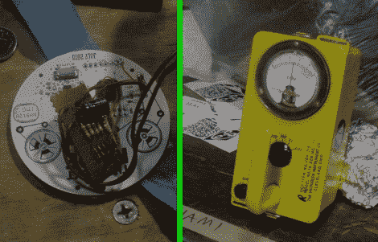

# 希望徽章接近传感器

> 原文：<https://hackaday.com/2010/07/26/hope-badge-proximity-sensor/>

希望会议是在上周末举行的，[内森]花了一些时间与本地 256 制造商的成员一起开发这个徽章接近传感器。他们拿走了其中一个希望徽章，这个徽章在[上有一个无线电，用于跟踪网络](http://hackaday.com/2010/06/22/next-hope-badge-hacking-primer/)，并为它的 MSP430 编写代码，以检测附近的其他徽章。它使用他们带来的盖革计数器作为外壳，重新利用模拟仪表来反映该地区活跃的无线电信号水平。休息之后你会看到他们的演示片段。

如果你设法得到了这些徽章，不要羞于分享你的黑客。我们想见他们。

 <https://www.youtube.com/embed/7quhFYJxMok?version=3&rel=1&showsearch=0&showinfo=1&iv_load_policy=1&fs=1&hl=en-US&autohide=2&wmode=transparent>

 </body> </html>