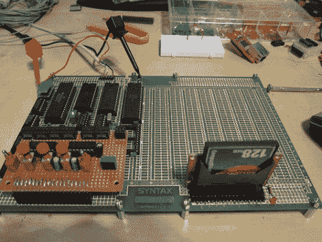

# 6809 计算

> 原文：<https://hackaday.com/2010/07/27/6809-computing/>

【马修·阿诺夫】[围绕](http://www.msarnoff.org/projects/6809/)[摩托罗拉 6809](http://en.wikipedia.org/wiki/Motorola_6809) 处理器建造了一台 8 位计算机。他选择这款处理器是因为似乎有很多 [Z80 版本](http://hackaday.com/2009/10/30/processor-built-with-transistor-transistor-logic/)，他想尝试一些不同的东西。

这实际上相当有力。他用 512 KB 的 SRAM 存储器为机器提供 2 MHz 的时钟。FAT 格式的紧凑型闪存提供大容量存储。他用串行连接作为用户界面。休息之后，你可以看到他的示波器被用作监视器。这很容易通过将串行输出连接到他以前的项目之一的[终端示波器](http://hackaday.com/2010/02/24/oscilloscope-doubles-as-a-serial-terminal/)来完成。T3[https://www.youtube.com/embed/3Dd1y3rbPck?version=3&rel=1&showsearch=0&showinfo=1&iv_load_policy=1&fs=1&hl=en-US&autohide=2&wmode=transparent](https://www.youtube.com/embed/3Dd1y3rbPck?version=3&rel=1&showsearch=0&showinfo=1&iv_load_policy=1&fs=1&hl=en-US&autohide=2&wmode=transparent)

[谢谢马克]