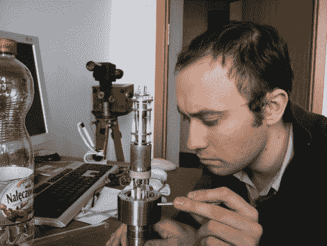

# 在家制作谢妮电子管

> 原文：<https://hackaday.com/2010/07/27/making-nixie-tubes-at-home/>

【亚历山大·扎瓦达】[在自己家里制作真空管](http://tubedevices.com/alek/pwl/pwl_e.htm)。他所承担的最具挑战性的建造工作之一是生产一个可工作的数码管。他[在一个 PDF](http://tubedevices.com/alek/pwl/lc1d/homemade_nixie_tubes.pdf) 中描述了这个过程，涵盖了他的成功和失败。看来最难的部分是让管子充满适当的气体，在适当的压力下，并牢牢密封。最后，他成功制造了一个有三个数字(0、1 和 2)的电子管，在烧坏之前工作了大约 700 个小时。

[亚历山大]加入了[杰里·埃尔斯沃斯]的黑客短名单，他们可以在家里完成极端的工业制造。值得称赞。

[谢谢邓肯]