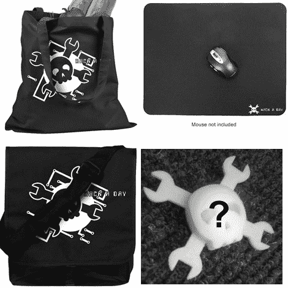

# 商店更新:包，垫，可能还有徽章。

> 原文：<https://hackaday.com/2010/07/27/store-update-bags-pads-and-possibly-badges/>

一些新产品已经进入我们的手中，只等着在上面贴上一些很棒的 Hack a Day 标志。我们已经添加了几个包，一些巨大的鼠标垫以及普通的鼠标垫，我们正在考虑添加[黑客日徽章](http://hackaday.com/2010/01/12/how-to-make-a-printable-ces-badge/)。你以前见过徽章，[当我们带他们去 CES](http://hackaday.com/2010/01/09/ces-update-ces-badges/) 的时候。[Devlin]估计发货前每个成本为 25 美元。我们希望在他开始推出这些东西之前得到一些反馈。有多少人想要一个？