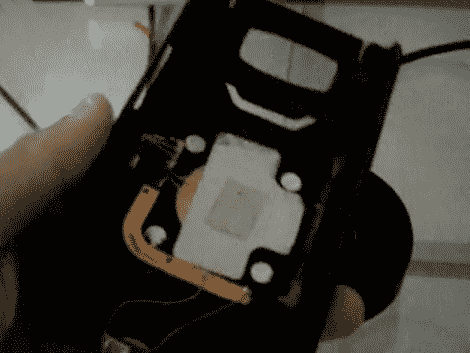

# 更新:定制手机感应充电

> 原文：<https://hackaday.com/2010/08/01/update-custom-cellphone-induction-charging/>

这是一个[定制的背板，带有感应充电电路](http://www.slatedroid.com/showthread.php/3640-My-HTC-HD2-mod-Custom-credit-card-case-with-induction-charging?p=25698#post25698)，是【德里克·休斯】为他的 HTC HD2 手机打造的。当我们上周与他联系时，他向我们展示了[如何在不使保修无效的情况下添加感应充电器](http://hackaday.com/2010/07/28/inductive-cellphone-charging-without-voiding-warranty/)，但这不是很好，因为库存背板阻挡了感应场，无法使用。如果你想花些时间在构建上，他提出的解决方案可以在任何设备上使用。

他接了两个不同的售后案例。一个适合他的手机，另一个是用来存放信用卡的黑莓手机套。在手机套背面切了一个洞后，他用环氧树脂将信用卡支架固定到位，用 Bondo 将接缝抹平，然后重新上漆。充电器不仅可以放在信用卡盒里，还可以放一张信用卡。[Derek]还测量了电路周围的磁场，发现它们不会损坏你一直带在身上的那张[美国运通黑卡](http://www.mahalo.com/how-to-get-an-american-express-black-card)上的磁条。在休息后的视频中，他提到完成这个案例的最后一步将是找到一个 90 度的 USB 插头，因为当前的连接器有点碍眼。

 <https://www.youtube.com/embed/DgNOqJBSKmQ?version=3&rel=1&showsearch=0&showinfo=1&iv_load_policy=1&fs=1&hl=en-US&autohide=2&wmode=transparent>

 </body> </html>